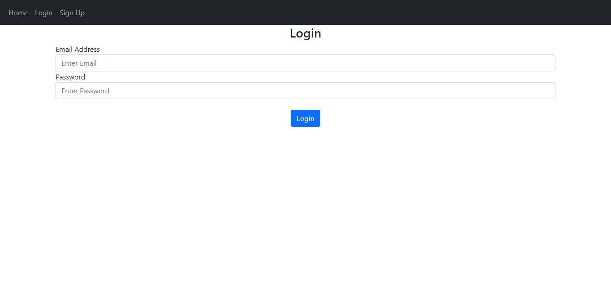

# Projeto em flask com micro blog 
 

* treinamento em flaskframework 

# Anotações 
- Para roda o projeto de login em sua máquina, é necessario que tenha o python 3.9 ao 3.10
- Executar sem depurar pois o banco de dados que está neste projeto é do flask

# Condições  
- Importante que você tenha instalado o framework flask é necessário
- python instalado em sua máquina 
- uma IDE de preferência

# Dica 
### Projeto 
- Se você pretende usar o projeto adiante para um projeto seu 
- Necessário que instala as dependencias do arquivo txt, 'requeriments'
- O comando é pip install -r requirements.txt

## Fundamentos do treinamentos
 

* treinamento de flaskframework me login, sing-up

* Aonde as pessoas entram no meu blog, se cadastra, postam   suas     postagens e depois sai com o logout 

# Motivo do projeto em flask

-Treinamento, e um processo seletivo para um emprego em python dev
-Infelizmente não conseguir o emprego, mas passo bem ! ksks..
- Agradeço á quem lêu até aqui, abraços

# Redes sociais 

 
# fim 

